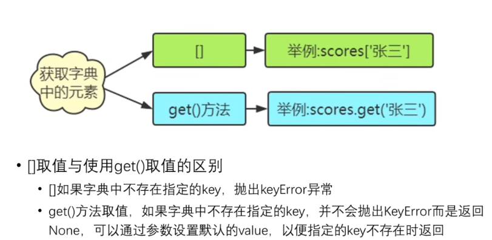
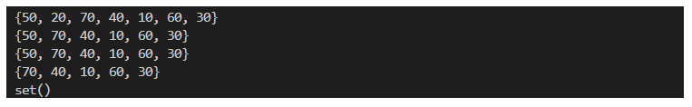
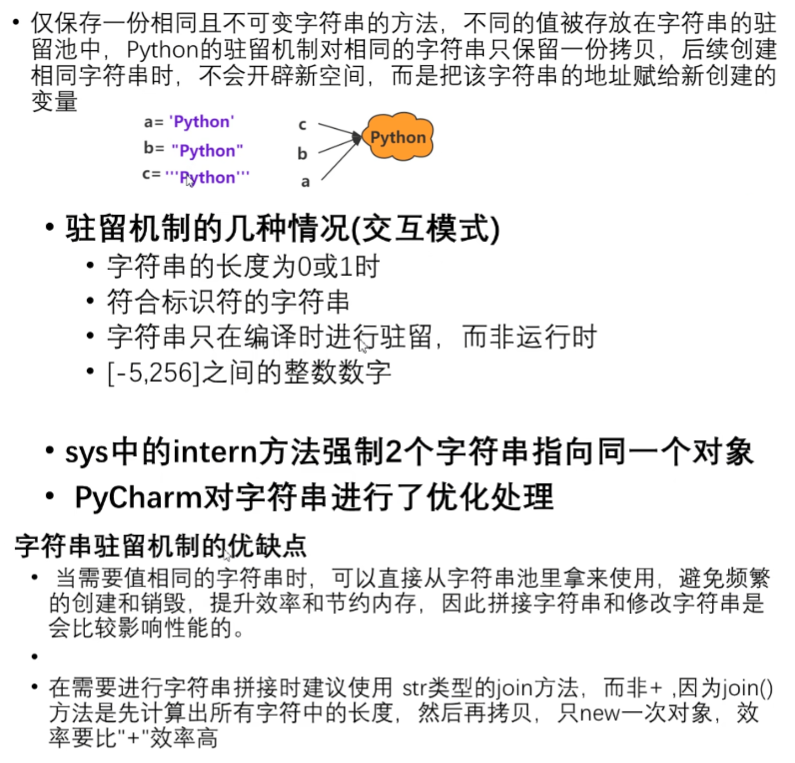
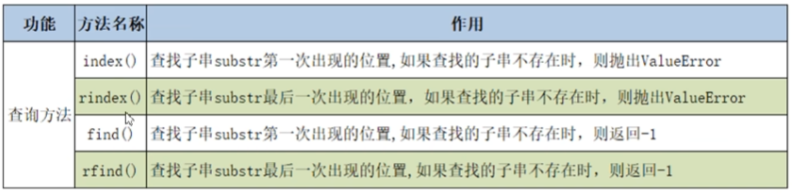

# Python基础语法

## 输出函数

### print（）函数

print()函数可以输出数字、字符串、含有运算符的表达式


将数据输出到文件


注意点：指定的文件要存在，使用file = fp的形式，fp为文件指针。

print()输出后会自动换行，可以进行不换行输出


### 格式控制

```python
name = 'ZhangSan'
age = 20
height = 1.77777

'''%作占位符'''
print('My name is %s,I am %d years old.And I am %.2f meters tall.' % (name,age,height)) #括号内是元组

'''{ }作占位符'''
print('My name is {0},I am {1} years old.And I am {2:.3} meters tall.'.format(name,age,height))  #利用format方法

'''python3的方法'''
print(f'My name is {name},I am {age} years old.And I am {height:.3} meters tall')   #单引号前面加f
```


%p.qf  p为数据宽度，q为保留小数位数

{0: p.q} 冒号之后，p为数据宽度，q表示一共保留q个数字(含整数部分)


## 变量的定义与使用


变量由三个部分组成

·标识：表示对象所存储的内存地址，使用内置函数id(obj)获取；

·类型：表示对象的数据类型，使用内置函数type(obj)获取；

·值：表示对象所存储的具体数据，使用print(obj)打印输出。


当进行多次赋值的时候，变量名会指向新的空间

## 数据类型

常用数据类型：

int  整数类型

float  浮点数类型

bool  布尔类型

str 字符串类型

### int类型

十进制—>默认

二进制—>以0b开头

八进制—>以0o开头

十六进制—>以0x开头


### float类型

浮点数由小数和整数部分组成；

浮点数存储具有不精确性

使用浮点数计算，可能会出现小数位数不确定的情况（通过导入decimal模块解决）


导入decimal


### bool类型

用来表示真或假的值

布尔值可以转换为整数：True->1; False->0

```python
#bool类型
f1 = True
f2 = False
print(f1,type(f1))
print(f2,type(f2))

#bool类型可以转换成整数直接计算
print(f1+1)
print(f2+1)

```


### 字符串类型

字符串又被称为不可变的字符序列

可以使用单引号、双引号、三引号、四引号来定义

单引号和双引号定义的字符串必须在一行

三引号定义的字符串可以分布在多行

```python
str1 = '人生苦短,我用Python'
str2 = "人生苦短,我用Python"
str3 = """人生苦短,
我用Python"""
str4 = '''人生苦短,
我用Python'''
print(str1,type(str1))
print(str2,type(str2))
print(str3,type(str3))
print(str4,type(str4))
```


## 类型转换

为了将不同数据类型的数据拼接在一起，则需要使用到数据类型转换

```python
name = '张三'
age = 20
print(type(name),type(age))
#可见name与age数据类型不同
print('我叫'+name+'今年'+age+'岁')
#当str类型和int类型连接时会报错，解决方案：类型转换
#修改后代码，通过str()函数将age转换为了str类型
print('我叫'+name+'今年'+str(age)+'岁')
```


int()：文字类和小数类字符串，无法转换

float()：文字类无法转换成整数，整数转换为浮点数，末尾补.0

str()

```python
s1 = '128'
f1 = 98.7
s2 = '76.77'
ff = True
s3 = 'hello'
print(type(s1),type(f1),type(s2),type(ff),type(s3))
print(int(s1),type(int(s1)))#将str转换成int类型，字符串为 数字串
print(int(f1),type(int(f1)))#将float转换成int类型，截取整数部分
print(int(ff),type(int(ff)))#将bool转换成int类型
#print(int(s2),type(int(s2))) #将str转成int类型，报错，因为字符串为小数串
#print(int(s3),type(int(s3))) #将str转成int类型，报错，因为字符串必须为数字串，且为整数串
```


```python
s1 = '128.98'
s2 = '76'
ff = True
s3 = 'hello'
i=98
print(type(s1),type(s2),type(ff),type(s3),type(i))
print(float(s1),type(float(s1)))
print(float(s2),type(float(s2)))
# print(float(ff),type(float(ff))) #报错，字符串的数据若为非数字串，则不允许转换
# print(float(s3),type(float(s3)))
print(float(i),type(float(i)))
```


## 注释

中文编码声明注释->加在文件开头,用于指定源码文件的编码格式

#coding:gbk

#coding:utf-8

## input函数

作用：接受来自用户的输入

返回值类型：输入值的类型为str

值的存储：使用=对输入的值进行存储

```python
a = input('输入a的值')

print(a,type(a))
```


例子：

```python
#从键盘录入两个整数,然后求他们的和

a = input('请输入a = ')
b = input('请输入b = ')
print(type(a),type(b))
print(a+b)   #加号仅起到连接作用
#利用类型转换
a = int(a)
b = int(b)
print(a+b)
```


## 运算符

### 算数运算符

标准运算：+-*/

取余：%

整除：//  （一正一负，向下取整）

幂运算：**

### 赋值运算符

执行顺序：从右到左

支持链式赋值：a=b=c=12

支持参数赋值:+=、-=、*=

支持系列解包赋值 a,b,c = 20,30,40

例：交换两个变量的值

```python
a=12
b=13
print('交换前',a,b)
a,b=b,a
print('交换后',a,b)
```


### 比较运算符

对变量或表达式的结果进行大小、真假等比较

返回值为：bool类型

```python
a=12
b=12
print(a==b) #True 说明a与b的value相等
print(a is b) #True 说明a与b 的id标识相同
print（a is not b） #False
#但以下情况要注意
lst1=[11,22,33,44]
lst2=[11,22,33,44]
print(lst1==lst2)  #True
print(lst1 is lst2)  #False
print(id(lst1))
print(id(lst2))
```


### 布尔运算符

对布尔值之间的运算

and与、or或、not非、in、not in

```python
s = 'hello world'
print('w' in s)
print('s' in s)
print('h' not in s)
```


### 位运算

将数据转换成二进制进行计算

位与&、位或|、左移<<、右移>>

## 程序组织结构

### 顺序结构

程序从上到下顺序的执行代码，中间没有任何判断和跳转直到程序结束。

### 对象的布尔值

所有对象都有一个bool值，获取对象的布尔值，使用bool()

False、数值0、None、空字符串、空列表、空元组、空字典、空集合

### 分支结构

程序根据判断条件的布尔值选择性的执行部分代码

#### 单分支结构

*if 条件表达式：*

​			*条件执行体*

```python
money=1000  #余额
s = int(input('请输入取款金额')) #取款金额
#判断余额
if s<=money:
    money = money-s
    print('取款成功,余额为:',money)
```


#### 双分支结构

*if 条件表达式：*

​			*条件执行体1*

*else:*

​			*条件执行体2*

```python
money=1000  #余额
s = int(input('请输入取款金额')) #取款金额
#判断余额
if s<=money:
    money = money-s
    print('取款成功,余额为:',money)
else:
    print('取款失败')
```


#### 多分支结构

*if 条件表达式1：*

​			*条件执行体1*

*elif 条件表达式2:*

​			*条件执行体2*

*elif 条件表达式3:*

​			*条件执行体3*

*else:*

​			*条件执行体4*

### 条件表达式

条件表达式是if……else的简写

语法结构：

*x   if   判断条件   else   y*

运算规则：

若判断条件为真，条件表达式返回值位x，否则返回值为y。

```python
a = int(input('请输入a = '))
b = int(input('请输入b = '))
c = a if a>=b else b
print('max = ',c)

```


### pass语句

pass语句什么都不做，只是一个占位符，用在语法上需要语句的地方

一般和下列语句一起使用

if语句的条件执行体

for-in语句的循环体

定义函数的函数体

### range()函数

用于生成一个整数序列

创建range的三种方式：


返回值类型是一个迭代器对象

```python
r = range(10)
print(r) #range(0,10)
print(list(r))  #用于查看range对象的整数序列,list是列表的意思
```


用in与not in判断整数序列中是否存在指定的整数

**range类型的优点：不管range对象表示的整数序列有多长，所有range对象占用的内存空间是相同的，因为仅仅需要存储start，stop和step，只有当用到range对象时，才会去计算序列中的相关元素。**

### 循环结构

#### while循环

*while   条件表达式：*

​				*条件执行体*

```python
a = 1
while a<10:
    print(a)
    a+=1
```


#### for-in循环

in表达从(字符串、序列)中依次取值，又称遍历

for-in遍历的对象必须是可迭代对象（字符串、序列等）

语法结构：

*for  自定义变量   in   可迭代对象：*

​				*循环体*

```python
for item in 'Python':
    print(item)
```


```python
for i in range(10):
    print(i)
```


若在循环体中不需要用到自定义变量，可以将自定义变量写为下划线：“_”

```python
for _ in range(5):
    print('Python')
```


### 流程控制

#### break

break语句用于结束循环结构，常与分支结构if一起使用。


```python
passwd = '112233'   #密码
ent = input('请输入密码:')
for i in range(2):   #最多录入三次，如果正确就结束循环
    if ent == passwd:
        print('密码正确!')
        break
    else:
        ent = input('密码错误,请再次输入:')
```


#### continue

continue语句用于结束当前循环，而进入下一次循环，通常与分支结构中的if一起使用


```python
#输出1-50之间的所有5的倍数
for i in range (51):
    if i%5!=0:
        continue
    print(i)
```


#### else语句

与else语句配合使用的三种情况


```python
for item in range(3):
    pwd = input('请输入密码:')
    if pwd == '8888':
        print('密码正确!')
        break
    else:
        print('密码错误:')
else:                           #只有当循环体中没有执行break语句时，才会执行else后的语句
    print('对不起,三次密码均输入错误!')
```


------


# 列表list

变量可以存储一个元素，而列表作为一个容器，可以存储N多个元素，程序可以方便的对这些元素进行整体操作

列表相当于其它语言中的数组，但是列表的内存是动态分配的

变量 存储的是对一个对象的引用(id值)，而列表 存储的是对多个对象的引用


## 列表的创建

创建方式：

1、使用中括号

2、使用内置函数list（）

列表需要使用中括号，元素之间用英文逗号分隔

```python
lst = ['hello','world',98]
print(id(lst))
print(type(lst))
print(lst)  #整体操作
```


使用内置函数list（）

```python
lst = list(['hello','world',98])
print(id(lst))
print(type(lst))
print(lst)  #整体操作
```


## 列表的特点

列表元素有序排序，索引映射唯一的元素，可以存储重复数据


索引的语法结构：

*列表名[元素在列表中的相对位置]*

```python
lst = list(['hello','world',98])
print(lst)
print(lst[0]) #正数索引
print(lst[-3]) #负数索引
```


## 列表的查询

### 获取列表中指定元素的索引

#### index()


语法结构：

*列表名.index(列表元素)*

*列表名.index(列表元素，start，end)*    #在索引为[start,end)的范围查找。

```python
lst = list(['hello','world',98,'hello','world'])
print(lst.index('hello'))
print(lst.index('hello',1,4))
```


### 获取列表中的单个元素

正向索引从 0 ~ N-1

逆向索引从 -N ~ -1

指定索引不存在，抛出IndexError

### 获取列表中的多个元素（切片操作）

语法格式：

*列表名[start：stop：step]*

会切出来一个新的列表对象


```python
lst = list(['hello','world',98,'hello','world','seven',88])
lst2 = lst[1:4:2]  #  start:stop:step
lst3 = lst[1:4]  #不写步长，则默认为1
lst4 = lst[:6:2]  # 不写start，则start默认为列表第一个位置0
lst5 = lst[1::2]  # 不写stop，则stop默认为列表最后一个位置
lst6 = lst[::-1]  #步长为负数，则逆序输出
print(lst)
print(lst2)
print(lst3)
print(lst4)
print(lst5)
print(lst6)
```


## 列表元素的判断和遍历

用in和not in 判断指定元素是否在列表中

列表元素的遍历：

*for  迭代变量  in  列表名：*

​				*操作*

```python
lst = list(['hello','world',98,'hello','world','seven',88])
for item in lst:
    print(item)
```


## 列表增加元素

append（）在列表的末尾添加一个元素

extend（）在列表的末尾至少添加一个元素

insert（）在列表 的任意位置添加一个元素

切片  在列表的任意位置添加至少一个元素

### append（）

```python
lst = list([11,22,33,44,55,66,77,88,99,00])
print(id(lst))
print(lst)
lst.append(100)
print(id(lst))   #id标识相同，可见没有新建列表对象
print(lst)
```


```python
lst1 = list([11,22,33,44,55,66,77,88,99,00])
lst2 = ['hello','world']
print(lst1)
lst1.append(lst2)  #将lst2作为一个元素放到了列表末尾
print(lst1)
```


### extend（）

在列表末尾一次性添加多个元素

```python
lst1 = list([11,22,33,44,55,66,77,88,99,00])
lst2 = ['hello','world']
print(lst1)
lst1.extend(lst2)  #extend将lst2中元素分开添加到lst1的末尾，不同于append
print(lst1)

```


### insert（）

*列表名.insert（索引，待插入元素）*

```python
lst1 = list([11,22,33,44,55,66,77,88,99,00])

print(lst1)
lst1.insert(1,90) 

print(lst1)
```


### 切片

```python
lst1 = list([11,22,33,44,55,66,77,88,99,0])
lst2 = ['hello','world']
print(lst1)
lst1[1:] = lst2    #将切掉的地方用新列表替换
print(lst1)
```


## 列表删除元素

remove（）一次删除一个元素，重复元素只删除一个

pop（）删除一个指定索引位置上的元素，若不指定索引则删除最后一个元素

切片   一次删除至少一个元素

clear() 清空列表

del  删除列表

### remove（）

```python
lst1 = list([11,22,33,11,22,33])
print(lst1)
lst1.remove(22)  #重复元素只移除第一个
print(lst1)
```


### pop（）

```python
lst1 = list([11,22,33,11,22,33])
print(lst1)
lst1.pop(3)  #删除索引为3的元素删除
print(lst1)
lst1.pop()  #删除最后一个元素
print(lst1)
```


### 切片

```python
lst1 = list([11,22,33,11,22,33])

#删除至少一个元素，但是会产生一个新的列表对象
newlst = lst1[1:3]
print('原列表',lst1)
print('新列表',newlst)

#不产生新的列表对象，而是删除原列表元素的内容
lst1[1:3] = []  #将1~3位置上的元素用空列表替代
print(lst1)
```


### clear（）

```python
lst1 = list([11,22,33,11,22,33])

#清除列表中所有元素
print(lst1)
lst1.clear()
print(lst1)
```


### del

```python
lst1 = list([11,22,33,11,22,33])

#清除列表对象
print(lst1)
del lst1
print(lst1)

```


## 修改列表元素

```python
lst1 = list([11,22,33,11,22,33])
print(lst1)
#一次修改一个值
lst1[2] = 100
print(lst1)

lst1 = list([11,22,33,11,22,33])
#一次修改多个值
lst1[1:3] = [300,400,500,600]
print(lst1)
```


## 列表的元素排序

### sort() 不会产生新的列表对象

*列表名.sort(reverse = True)*

```python
lst1 = list([11,2,323,311,22,133])
print('排序前列表',lst1,id(lst1))
#默认升序排序
lst1.sort()
print('排序后列表',lst1,id(lst1))
#通过指定关键字参数实现降序排序
lst1.sort(reverse=True)  #reverse=True降序排序， reverse=False升序排序
print('排序后列表',lst1,id(lst1))
```

### sorted()  产生新的列表对象

*新列表名 = sorted(列表名,reverse = True)*

```python
lst1 = list([11,2,323,311,22,133])
print('排序前列表',lst1,id(lst1))
#默认升序排序
newlst = sorted(lst1)
print('排序后列表',newlst,id(newlst))
#通过指定关键字参数实现降序排序
newlst = sorted(lst1,reverse=True)  #reverse=True降序排序， reverse=False升序排序
print('排序后列表',newlst,id(newlst))
```


## 列表生成式

简称“生成列表的公式”

语法格式：

*[表示列表元素的默认表达式    for    自定义变量    in   可迭代对象]*

```python
lst = [item*4*item for item in range(0,100,5)]
print(lst)

```

------


# 字典dict

字典是python的内置数据结构，与列表一样是一个可变序列，放在字典中的键（key）是一个不可变序列

以键值对的方式存储数据，字典是一个无序序列

*scores = {'张三'：100，‘李四’：200，‘王五’：21}*

字典名 = {键 ：值 ，键 ：值 ，键 ：值 ，键 ：值}


## 字典的特点


## 字典的创建

1、使用花括号

*字典名 = {键 ：值 ，键 ：值 ，键 ：值 ，键 ：值}*

2、使用内置函数dict（）

*字典名 = dict(键 = 值，键 = 值)*

```python
score1 = {'Zhang':100,'Liu':122,'Chen':321}

score2 = dict(name = 'Jack',age = 20,add = 'LA') 

print(score1)
print(score2)
```


## 字典元素的获取



```python
score = {'Zhang':100,'Liu':122,'Chen':321}
#获取字典中的元素
#使用[]
a= score['Chen']
print(score['Zhang'])
print(a)
#使用get()
print(score.get('Zhang'))
print(score.get('Huang'))
print(score.get('Huang',99))  #99是查找’Huang‘所对应Value不存在时，提供的默认值
```


## 字典的增删改

### key的判断


### 字典元素的删除

*del scores[ ' 张三 ' ]*

```python
score1 = {'Zhang':100,'Liu':122,'Chen':321}
print(score1)
#删除指定key-value对
del score1['Zhang']
print(score1)
#清空字典元素
score.clear()
print(score1)
```


### 字典元素的新增、修改

```python
score1 = {'Zhang':100,'Liu':122,'Chen':321}
print(score1)
#新增键值对
score1['Zhu']=98
print(score1)
#修改键值对
score1['Zhu']=100
print(score1)
```


## 获取字典视图


```python
score = {'Zhang':100,'Liu':122,'Chen':321}
print(score)
#获取所有的键
keys = score.keys()
print(keys)
print(type(keys))
print(list(keys))

#获取所有的值
values = score.values()
print(values)
print(type(values))
print(list(values))

#获取所有的键值对
item = score.items()
print(item)
print(list(item))   #转换后的列表元素是由元组组成
```


## 字典元素遍历

语法结构：

*for  自定义变量  in  字典名*：

​					*操作*

自定义变量被赋的值是键

```python
score = {'Zhang':100,'Liu':122,'Chen':321}
for item in score:
    print(item,score[item])
```


## 字典生成式

### zip()

内置函数zip（）用于将可迭代对象作为参数，将对象中对应元素打包为一个元组，然后返回由这些元组组成的列表。


```python
a = ['Zhang','Liu','Li','Cheng','Zhu']
b = [120,133,121,221,21,2111,2123,13,11]
c = [[12,12],[122,11],[123,32],[12,98]]
d = list(zip(a,b,c))   #要用list命令将zip对象转换成列表，列表中的每一个元素都是一个元组
print(d,type(d))
```


*字典名 = {自定义变量1 ：自定义变量2   for   自定义变量1 ,自定义变量2    in   zip(列表名1，列表名2)}*

```python
items = ['fruits','books','phone','pigs']
prices = ['96','78','222','555','122','2112']  #以元素少的来进行打包

dict = {item:price for item , price in zip(items,prices)}
print(type(dict))
print(dict)
```


------


# 元组tuple


## 元组的创建方式

直接用小括号（），只包含一个元组元素的需要必须加上逗号

使用内置函数turple（）

```python
t = ('Zhang',98,[98,99,100])
print(t,'\n',type(t))

t1 = (1)
print(t1,'\n',type(t1)) #class int
t1 = (1,)               #逗号不能丢
print(t1,'\n',type(t1)) #class tuple

t2 = tuple(('Zhang',98,[98,99,100]))
print(t2,'\n',type(t2))
```


## 元组的遍历

元组是可迭代对象，可以用for-in遍历

```python
t = ('Zhang',98,[98,99,100],11,213,'liu',[12,12])
print(t,'\n',type(t))
for item in t:
    print(item)
```


------


# 集合set


## 集合的创建

直接用花括号{}

使用内置函数set()

集合的元素同字典的key一样，不允许重复

```python
s = {'Chen','Liu','Gong','Zhu'}

s2 = set({11,12,12,33,13,31,33})   #集合元素不允许重复
s3 = set([121,12,34,445,13,41])
s4 = set((1,2,3,4,5,6,7))
s5 = set('python')
print(s)
print(s2)
print(s3)
print(s4)
print(s5)  #集合中的元素无序
```


## 集合的相关操作


### 新增操作

```python
s = set({10,20,30,40,50,60,70})
print(s)
s.add(100)
print(s)
s.update({200,400,300})
#s.update((200,400,300))
#s.update([200,400,300])
print(s)
```


### 删除操作

```python
s = set({10,20,30,40,50,60,70})
print(s)
s.remove(20)
print(s)
s.discard(500)  #若元素不存在，也不会抛出异常
print(s)
s.pop()   #删除一个任意元素,pop方法不可以指定参数
print(s)
s.clear()  #清空集合
print(s)
```



## 集合间的关系


```python
s1 = set({10,20,30,40,50,60,70})
s2 = set({10,20,30})
s3 = set({20,30,40,50})
print(s2.issubset(s1))      #s2是否为s1的子集
print(s1.issuperset(s2))   #s1是否为s2的超集
print(s2.isdisjoint(s3))    #True 表示没有交集，False表示有交集
```


## 集合的数据操作


```python
s2 = set({10,20,30})
s3 = set({20,30,40,50})
'''交集'''
sp1 = s3.intersection(s2)
sp2 = s3 & s2
print(sp1)
print(sp2)

'''并集'''
sa1 = s2.union(s3)
sa2 = s2 | s3
print(sa1)
print(sa2)
```


经过交集、并集操作后的原集合不会出现变化

```python
s1 = set({10,20,30,40,50,60,70})

s2 = set({20,30,40,50,100,200})
'''差集'''
sd1 = s1.difference(s2)
sd2 = s1 - s2
print(sd1)
print(sd2)

'''对称差集'''
print(s1.symmetric_difference(s2))
print(s1^s2)
```


## 集合生成式

*集合名  =  {表示集合元素的表达式   for   自定义变量    in   可迭代对象}*

将{ }改为[ ]就是列表生成式

没有元组生成式

```python
s = {i*i for i in range(1,11,2)}
print(s)
```


------


# 列表、字典、元组、集合总结


------


# 字符串


python的基本数据类型，是一个不可变的序列

字符串的驻留机制




## 字符串的常用操作

### 查询字串的相对位置



```python
s = 'hello,hello'
print(s.index('el'))    # 1
print(s.rindex('el'))   # 7
print(s.find('llo'))     # 2
print(s.rfind('ell'))    # 7
```

### 字符串的大小写转换


```python
s = 'hello World! Good study'
print(s,id(s))
#均会产生新的字符对象
s1 = s.upper()
s2 = s.lower()
s3 = s.swapcase()
s4 = s.capitalize()
s5 = s.title()
print(s,id(s))
print(s1,id(s1))
print(s2,id(s2))
print(s3,id(s3))
print(s4,id(s4))
print(s5,id(s5))
```


### 字符串内容对齐方法


*字符串名.center（宽度，‘填充符’）*

*字符串名.ljust（宽度，‘填充符’）*

*字符串名.rjust（宽度，‘填充符’）*

*字符串名.zfill（宽度）*

```python
s = 'hello World!'
print(s.center(20,'*'))
print(s.ljust(20,' '))
print(s.rjust(20))
print(s.zfill(15))
```


### 字符串的劈分


```python
s = 'hello World Python'
lst = s.split() #未指定分割符,则默认空格为分割符
print(lst)
lst2 = s.split(sep = 'l')
print(lst2)
lst3 = s.split(sep = 'l',maxsplit=1)  #maxsplit指定最大分割次数
print(lst3)
```


### 字符串判断的相关方法


### 字符串的替换与合并


*新字符串 = 字符串名.replace(被替换字串，替换字串的字符串，最大替换次数)*

```python
s = 'hello World Python'
p = 'python python python'
r = 'Java'
q = s.replace('Python',r)
p1 = p.replace('python',r)
p2 = p.replace('python',r,2)
print(s)
print(q)
print(p1)
print(p2)
```


*‘连接符’.join(列表或元组)*

引号内可以为空，例：   *‘ ’.join(Lst)*

```python
lst = ['hello','world','python']
s1 = '|'.join(lst)
s2 = '.'.join(lst)
print(s1)
print(s2)
```


### 字符串的比较操作


```python
print('apple'>'app')      #True
print('apple'>'banana')      #False
print(ord('a'),ord('b'))  #  97  98
print(chr(97),chr(98))     # a  b
```

### 字符串的切片操作

字符串是不可变类型，不具备增、删、改的操作

切片会产生新的对象


```python
s = 'hello python'

s1 = s[1:5]
s2 = s[:4]
s3 = s[3:]
s4 = s[1::2]
print(s1)
print(s2)
print(s3)
print(s4)
```


## 格式化字符串


```python
'''%作占位符'''
name = 'ZhangSan'
age = 20
print('My name is %s,I am %d years old' % (name,age)) #括号内是元组

'''{ }作占位符'''
name = 'ZhangSan'
age = 20
print('My name is {0},I am {1} years old'.format(name,age))  #利用format方法

'''python3的方法'''
print(f'My name is {name},I am {age} years old')   #单引号前面加f
```


## 字符串的编码转换


------

# 函数

函数：执行特定任务完成特定功能的一段代码

## 函数的创建与调用

*def  函数名  ([输入参数])：*

​			*函数体*

​			*[return   返回值]*

```python
def calc(a,b):   #a,b为形参 ，形参的位置是在函数的定义处
    c = a+b
    return c

a = int(input('input a = '))
b = int(input('input b = '))
c= calc(a,b)         #这里的a和b为实参
print('c = ',c)
```


## 函数的参数传递

### 位置实参

根据形参对应的位置进行实参传递

```python
def calc(a,b):   #a,b为形参 ，形参的位置是在函数的定义处
    c = a+b
    return c

c= calc(10，20)         #这里的10和20为实参，位置实参a=10,b=20
print(c)
```

### 关键字实参

根据形参名称进行实参传递

```python
def calc(a,b):   #a,b为形参 ，形参的位置是在函数的定义处
    c = a+b
    return c

c = calc(b = 10，a = 20)       #这里采用关键字实参方式,a=20,b=10
print(c)
```

在函数调用过程中，进行参数的传递，如果是不可变对象，在函数体的修改不会影响实参的值。

如果是可变对象，在函数体的修改会影响到实参的值


*可以通过加星号 "\*" 控制参数表列某些参数只能用关键字实参传递*

```python
def fun(a,b,*,c,d):
	print(a)
	print(b)
	print(c)
	print(d)

#fun(10,20,30,40)  #报错，因为加了*后面的参数只能用关键字实参传递
fun(10,20,c=30,d=40)  #正确
```


## 函数的返回值

无返回值，可以不写return

函数的返回值，如果是1个，直接返回原类型

函数返回多个值时，返回结果为元组

```python
def fun(num):
    odd = []
    even = []
    for item in range(0,num):
        if item%2 ==0:
            even.append(item)
        else:
            odd.append(item)
    return odd,even

a = int(input('a = '))
p = fun(a)
print(p)
```


## 函数的参数定义

### 默认值参数

函数定义默认值参数

函数定义时，给形参设置默认值，只有与默认值不符的时候才需要传递实参

```python
def fun(a,b =10):     #b为默认值参数
    print(a,b)

fun(10)
fun(10,30)
```


### 个数可变的位置参数


```python
def fun(*args):
    print(args)

fun(10)
fun(10,30)
fun(10,30,40)
```


### 个数可变的关键字参数


```python
def fun(**args):
    print(args)

fun(a = 10)
fun(a = 20,b =30)
fun(a= 20,b = 30, c = 40)
```


在函数的定义过程中，既有个数可变的位置参数（\*args）也有个数可变的关键字形参（\*\*args）时，要求个数可变的位置参数（\*args）放在个数可变的关键字形参（\*\*args）之前。

### 总结


```python
def fun(a,b,c):
    print(a)
    print(b)
    print(c)

fun(10,20,30)  #位置传参
lst = [20,30,40]
#fun(lst)  #报错，参数数量不够
fun(*lst)  #将列表每个元素转换为位置实参

fun(a=10,b=20,c=30)  #关键字传参
dic = {'a':10,'b':20,'c':30}
#fun(dict)  #报错，参数数量不够
fun(**dic)   #将字典中的键值对都转换为关键字实参
```


## 变量的作用域


## 递归函数


斐波那契数列：

```python
#Fibnacci数列
def fib(n):
    if n ==1 or n==2:   #递归出口
        return 1
    else:
        return fib(n-1)+fib(n-2)


n = int(input('请问要输出几阶Fibnacci数列?\n'))
lst = []
for item in range(1,n+1):
    lst.append(fib(item))
print(lst)
```

